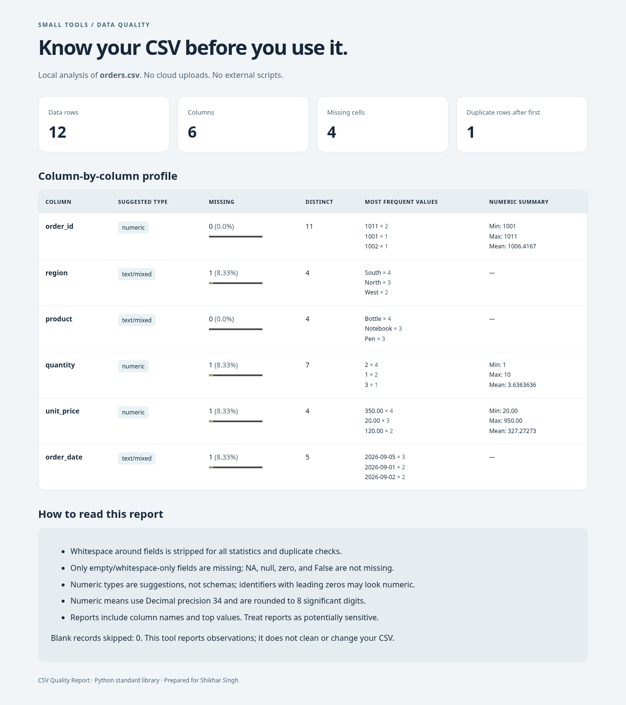

# CSV Quality Report

Turn a CSV into a readable offline HTML report and a machine-readable JSON
profile. Catch missing values, repeated rows, mixed-looking columns, and
unexpected values before starting analysis. **Python standard library only.**



## Run

Use Python 3.11–3.14. Run from this repository's directory:

```bash
bash setup.sh
.venv/bin/python -m csv_inspector examples/orders.csv --output-dir outputs/demo
open outputs/demo/report.html  # macOS; otherwise open with your browser
```

The sample has **12 rows, 6 columns, 4 missing cells, and 1 duplicate after the
first occurrence**. `report.json` contains the same statistics as the HTML.
Use a new output directory on repeat runs; existing directories are never
replaced. Input CSV files are not changed. You can also run with `python3`
directly because no third-party packages are required.

For a semicolon-separated file:

```bash
.venv/bin/python -m csv_inspector input/data.csv --delimiter ';' --output-dir outputs/my-report
```

Keep private CSVs under the ignored `input/` directory. The report includes
column names and most frequent values, so generated reports may also be
sensitive. It is a local reporting tool, not a data anonymizer.

## What's measured

Rows and columns; empty cells; duplicate normalized rows after their first
occurrence; distinct nonempty values; the three most common values per
column; suggested numeric/text/empty types; numeric minimum, maximum, and
mean when all nonempty values in a column are plain finite numbers.

Whitespace is trimmed. Empty/whitespace-only cells count as missing, but
`NA`, `null`, `0`, and `False` do not. Type inference is a suggestion: an ID
such as `00123` may look numeric. Decimal means are rounded to eight
significant digits, not guaranteed exact financial accounting.

## Tests

```bash
.venv/bin/python -m unittest discover -s tests -v
```

Includes actual CLI/report generation, sample metrics, UTF-8 BOM and Unicode,
quoted fields and newlines, malformed rows, non-finite numbers, HTML escaping,
input limits, and input/output preservation. See `docs/VALIDATION.md`.

## Scope and limits

UTF-8 CSV only; no Excel parser or delimiter guessing. Default caps: 20 MiB,
100,000 nonblank records, and 200 columns. Python's CSV parser also limits
very long fields. Data is held in memory inside these bounds; this is not a
big-data engine. HTML has no JavaScript, no external assets, and escapes data
as text. The tool reports problems; it does not silently repair your dataset.

## License and provenance

MIT. Synthetic sample data was created for this project. Prepared for
Shikhar Singh with ChatGPT assistance; see [docs/PROVENANCE.md](docs/PROVENANCE.md).
Official references: [Python csv](https://docs.python.org/3/library/csv.html),
[Decimal](https://docs.python.org/3/library/decimal.html), and
[HTML escaping](https://docs.python.org/3/library/html.html#html.escape).
